# < 크롤링을 이용한 브롤스타즈 코치 >


### 참고 - 브롤스타즈란?  

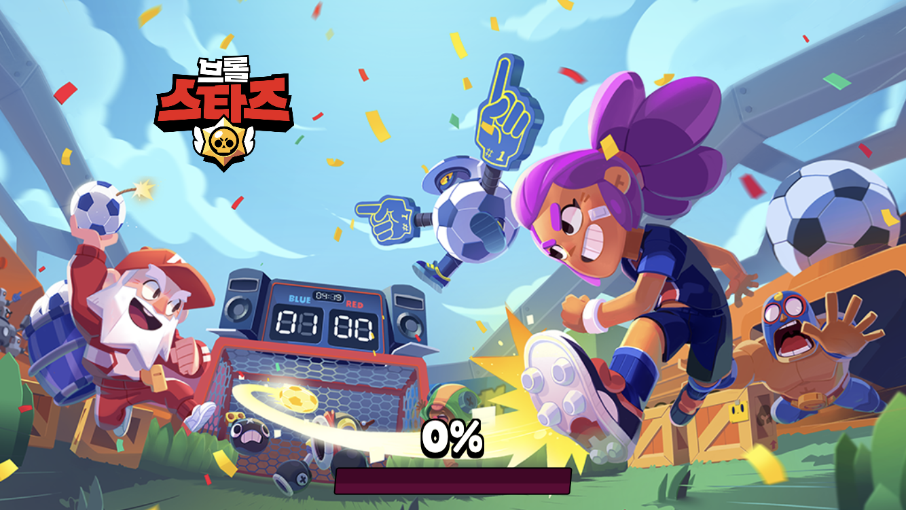  

 <center><br>브롤스타즈는 모바일 게임으로, 다양한 브롤러(게임 캐릭터) 중에 한 브롤러를 골라서 게임을 플레이 할 수 있다. <br></center>  

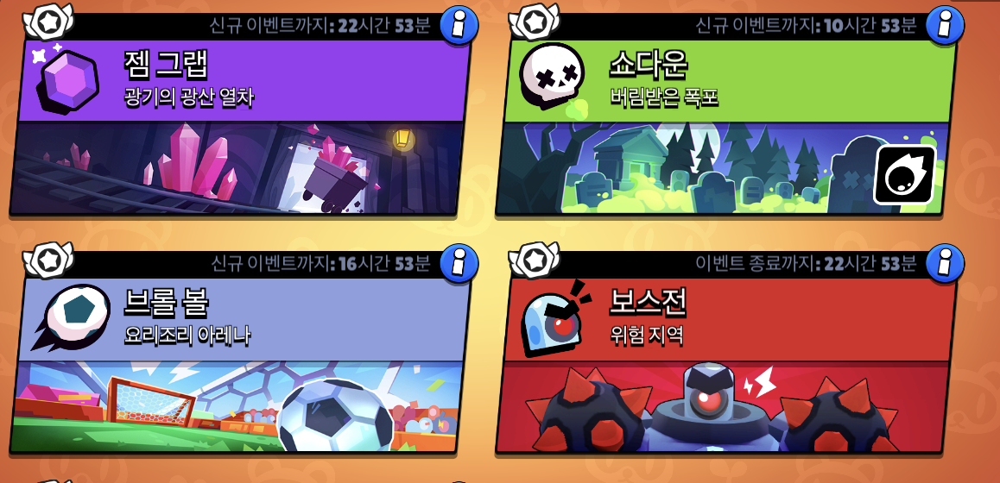   
 
<center><br>10개의 젬을 먼저 차지하면 이기는 젬그랩, 상대팀보다 2번의 골을 먼저 넣으면 이기는 브롤볼,<br>  
나사를 모아 로봇으로 상대편의 기지를 먼저 파괴하는 팀이 이기는 시즈팩토리 등 다양한 게임 모드가 있으며, <br>  
각 게임 모드별로도 다양한 맵이 존재한다. 매일 플레이할 수 있는 모드가 바뀐다. 대부분 3 vs 3 구도로 게임이 진행된다.<br>
팀전이기 때문에 팀 내의 브롤러 조합이 중요한 역할을 한다. </center>

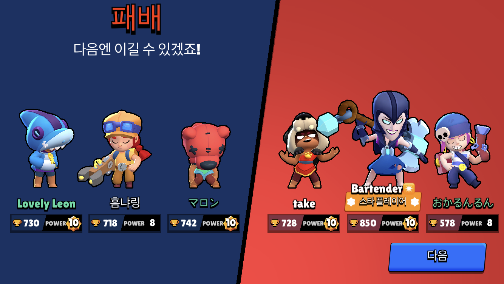 
<center><br>또한 게임이 종료되면 진 팀은 트로피 수가 줄어들고 이긴 팀은 트로피 수가 늘어난다. <br>
    그리고 승리한 팀 중에서 가장 기여를 많이 한 '스타플레이어'를 보여준다. <br></center>
 
*이미지 출처 : 나의 게임 화면*

## 1) 프로젝트 목표 및 내용  
  
- 궁극적인 목표는 브롤 스타즈 유저 개인의 게임 실력을 향상시키는 데 도움이 되는 프로그램을 제작하는 것이다.
- 직접적인 게임 실력 향상 외에도 본인의 플레이 스타일 파악에 도움을 주고자 한다.
- 브롤 스타즈 내에서 유저들과 나의 게임 플레이를 비교 분석해 개인별 브롤러 추천 등 맞춤형 게임 코치 프로그램을 제작한다.
- 자세한 내용은 밑에 서술한다.
    
      
## 2) 프로그램 제작 이유  
  
  ### 사람은 다 다른데, 정보도 사람마다 달라야 하지 않을까?
  
- 나는 1년이라는 꽤 오랜 시간동안 브롤스타즈라는 모바일 게임을 즐기고 있다. 게임을 하면서 느낀 점은 전적 검색 사이트, 인벤 등의  
  정보 사이트가 없어 정보를 얻기 번거롭다는 것이었다. 그러던 중 최근 슈퍼셀(브롤스타즈 제작회사)에서 공식 API를 공개하면서 정보를  
  주는 사이트들이 몇 개 등장했다. 나는 이런 사이트들이 굉장히 반가웠고 사이트들을 방문했다. 그리고 그 중 완성도 높은 두 사이트를 가져와봤다.

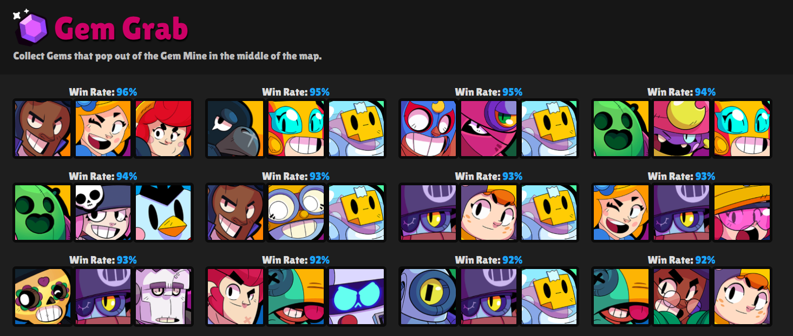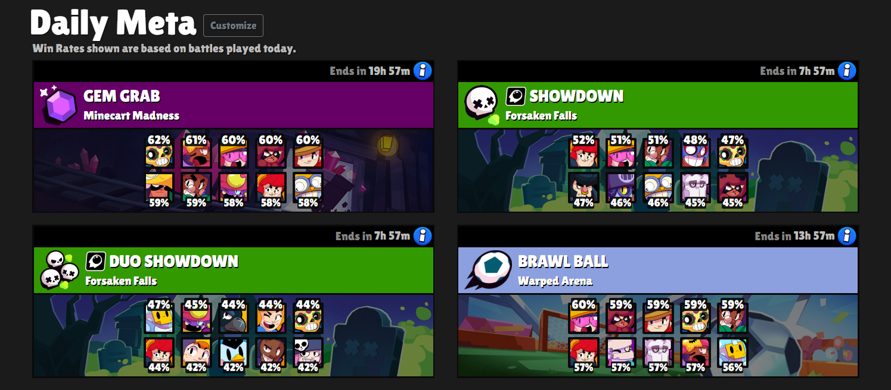
*출처:  https://www.starlist.pro/gamemodes/*

- 이 사이트에서는 크게 유저의 프로필 검색, 각 브롤러의 모드별 픽률과 승률, 각 조합의 모드별 픽률과 승률 기능을 제공한다.

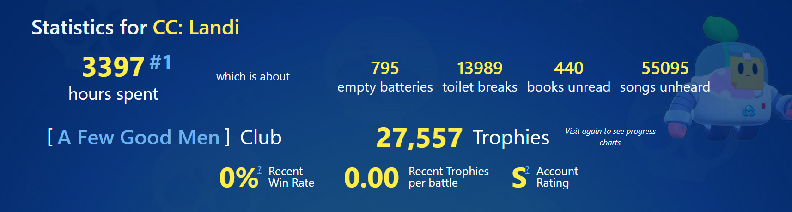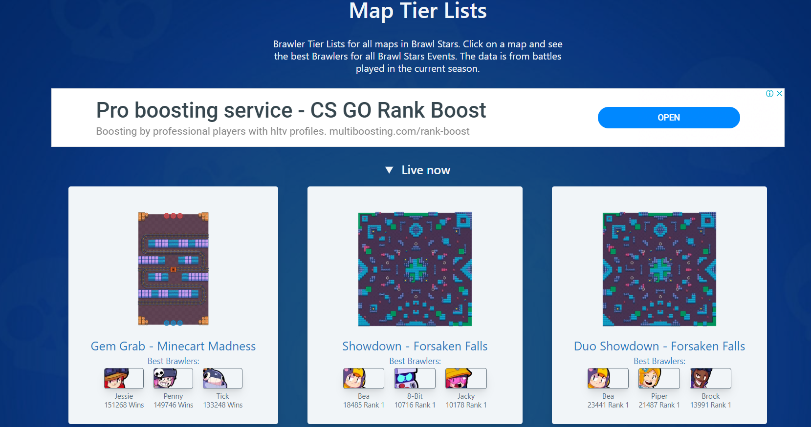
*출처 : https://brawltime.ninja/*

- 이 사이트에서도 크게 유저의 프로필 검색, 각 브롤러의 모드별 픽률과 승률을 제공한다.   
     
       
- 이 사이트들을 보면서 느낀 건 상당히 내용이 유사하고 있는 그대로의 사실을 통계적으로 보여준다는 점이었다.   
  생각해보면 이런 사이트들은 전형적인 틀이 있다. 왜 이런 정보 사이트에서는 유저의 프로필, 픽률, 승률 외에는 별 내용이 없을까?  
  데이터를 있는 그대로 보여주는 게 아니라 조금만 가공하면 색다른 프로그램이 나오지 않을까?  
  어떤 의미를 가지는 프로그램을 만들어볼까 하다가 문득 이런 생각이 들었다. 일반적으로 가장 승률이 높다고해서 나에게도 좋다는 보장이 있나?   
  사람마다 플레이 방식이 다르고, 좋아하는 브롤러가 다르고, 잘하는 브롤러가 다르다. 그러니까 유저 본인에게 맞춰 분석해주는 프로그램이   
  있으면 재밌지 않을까? 위에서 봤듯이 승률이 좋은 브롤러 & 조합과 같은 일반적인 정보는 많이 알려져 있다.  
  그러니까 나는 '맞춤형'에 집중해 도움이 될 정보를 주는 프로그램을 만들어 보기로 결정했다.  

  
## 3) 데이터 획득  
- https://developer.brawlstars.com/ 의 공식 API를 활용해 유저 프로필에 들어갈 닉네임,트로피 수,스타플레이어 횟수,브롤러정보 등을 수집했다.

- https://www.starlist.pro/gamemodes/ 에서 select를 이용해 파라미터로 모드 이름, 맵 이름을 크롤링하고 해당 맵에서 팀별, 브롤러별 승률 정보를 크롤링 한 후 각 정보를 저장했다.

#### 1. User클래스에서 데이터 획득
   https://developer.brawlstars.com/#/documentation 에서 브롤스타즈 공식 api를 이용한다.<br>
   GET /players/{playerTag} 부분의 데이터를 가져와 데이터를 딕셔너리 형태로 변환 후 필요한 데이터만 뽑아서 <br>
   User클래스 멤버 변수에 저장한다. <br>
   획득 과정은 밑과 같다.<br>
```python

#코드 중 getInfo 발췌
def getinfo(link):
    url = "https://api.brawlstars.com/v1"+link
    response = requests.get(url,headers = {"Authorization":"Bearer "+ apikey})
    info = response.json() #dict형으로 변환
    return info

#User 클래스 중 __init__() 일부 발췌
 def __init__(self, tag, player_info):
        self.battleTag = tag
        self.name = player_info["name"]
        self.trophies = player_info["trophies"]
        self.myBrawlers = player_info["brawlers"]
        self.Victories3vs3 = player_info["3vs3Victories"]
        self.soloVictories = player_info["soloVictories"]
        self.duoVictories = player_info["duoVictories"]
        self.battles = []
        self.playedModes = []
        self.playedMaps = []
        
#코드 중 getInfo 호출 발췌
player_info = getinfo("/players/%23"+battleTag[1:])         
```

#### 2. Battle 클래스에서 데이터 획득
   https://developer.brawlstars.com/#/documentation 의 브롤스타즈 공식 api를 이용한다.<br>
   /players/{playerTag}/battlelog 부분의 데이터를 가져와 딕셔너리 형태로 변환 후 필요한 데이터를 뽑아서 <br>
   Battle 클래스의 멤버 변수에 저장한다.<br>
   획득과정은 밑과같다.
   
```python
#코드 중 getInfo 발췌
def getinfo(link):
    url = "https://api.brawlstars.com/v1"+link
    response = requests.get(url,headers = {"Authorization":"Bearer "+ apikey})
    info = response.json() #dict형으로 변환
    return info

#User 클래스 __in__()중 battle 객체들 생성 과정 발췌
def __init__(self):
    for i in range(len(battle_info["items"])):
            battle = battle_info["items"][i]

#Battle 클래스 중 __init__() 일부 발췌
 def __init__(self, game):
        self.mode = None 
        self.Map = None
        self.bettleResult = None #승,패 저장
        self.myBrawler = None #내가 플레이한 브롤러 저장
        self.starPlayer = None
        
        self.myTeamComp = None #우리팀 조합 리스트
        self.myTeamCompStr = None #우리팀 조합을 string으로 변환
        self.enemyTeamCompStr = None #상대팀 조합 string
        
        myteam = False
        event = game["event"]
        self.mode = event["mode"]
        self.Map = event["map"]
        battle = game["battle"]

#코드 중 getInfo 호출해서 battle_info 받아오는 과정 발췌
battle_info = getinfo("/players/%23"+battleTag[1:]+"/battlelog")
```
#### 3. Rate 클래스에서 데이터 획득 및 가공
   https://www.starlist.pro/gamemodes/ 를 크롤링한다.<br>
   beautifulSoup 의 select()를 이용해서 원하는 정보가 들어있는 태그를 가져오고<br>
   Rate 클래스의 멤버 변수에 저장한다.<br>
   획득 및 가공과정은 밑과같다.
```python
# Rate 클래스의 멤버함수 getRate 발췌

def getRate(self): #사이트에서 일반적인 승률 정보 가져옴
        headers = {'user-agent': 'Mozilla/5.0 (Windows NT 10.0; Win64; x64) AppleWebKit/537.36 (KHTML, like Gecko) Chrome/79.0.3945.130 Safari/537.36'}
        r = requests.get(self.mapURL, headers=headers)
        soup = BeautifulSoup(r.text, 'html.parser')
        
        #브롤러별 승률
        brawlerSize = soup.select('#stats > tbody > tr')
        for i in range(len(brawlerSize)): 
            brawlerWinElem = soup.select('#stats > tbody > tr:nth-child({0}) > td:nth-child(2)'.format(i+1))
            #브롤러 승률정보가 들어 있는 태그 가져옴
            brawlerElem = soup.select('#stats > tbody > tr:nth-child({0}) > td > img'.format(i+1)) 
            #브롤러 이름정보가 들어있는 태그 가져옴
            brawlerName = brawlerElem[0].get('title') #브롤러 이름 가져옴
            self.brawlerWinRate[brawlerName] = brawlerWinElem[0].text[:-1] #브롤러이름과 승률을 매칭

        #조합별 승률
        teamWin = crawling(self.mapURL,'.text-blue')
        for i in range(len(teamWin)): 
            teamElements = soup.select('#teams > div > div:nth-child({0}) > a > div > img'.format(i+1)) 
            #조합의 브롤러 이름 정보가 들어있는 태그
            comp = []
            for elem in teamElements:
                comp.append(elem.get('title'))
            comp.sort()
            self.teamWinRate[','.join(comp)] = teamWin[i][:-1] #브롤러 이름과 승률 매칭
```

## 4) 구현 내용 설명   

### 데이터 가공과정  

#### 1. User 클래스의 데이터 가공
- Battle 클래스에 저장된 데이터를 가져와 가공해 해당 유저가 플레이한 기록이 있는 모드&맵들의 이름 리스트를 저장한다.<br>

```python
# User 클래스의 멤버함수 __init__ 발췌
def __init__(self, tag, player_info):
        #데이터 획득과정
        self.battleTag = tag
        self.name = player_info["name"]
        self.trophies = player_info["trophies"]
        self.myBrawlers = player_info["brawlers"]
        self.Victories3vs3 = player_info["3vs3Victories"]
        self.soloVictories = player_info["soloVictories"]
        self.duoVictories = player_info["duoVictories"]
        self.battles = []
        self.playedModes = []
        self.playedMaps = [] 
        
        #데이터 가공과정
        for i in range(len(battle_info["items"])):
            battle = battle_info["items"][i]
            self.battles.append(Battle(battle))
            self.playedModes.append(self.battles[i].mode.lower().replace(' ',''))
            self.playedMaps.append(self.battles[i].Map.lower().replace(' ',''))
```

#### 2. Battle 클래스의 데이터 가공
- 획득한 데이터를 가공해서 해당 게임에서의 사용된 조합, 내가 플레이한 브롤러 등을 저장<br>
```python
#Battle 클래스 중 __init__()일부 발췌
def __init__(self, game):
        if(self.mode == "soloShowdown"):
            rank = battle["rank"]
            if(rank <= 3):
                self.battleResult = "victory" #편의상 3등이내에 들면 승리, 들지못하면 패배라고 처리
            else:
                battleResult = "defeat"
            for player in battle["players"]:
                    if(player["tag"] == battleTag):
                        self.myBrawler = player["brawler"]["name"].title()
        else:
            if(self.mode == "duoShowdown" ): #듀오 쇼다운 모드일 경우 battleResult가 달라서 따로 처리
                rank = battle["rank"]
                if(rank <= 3): 
                    self.battleResult = "victory" #편의상 3등이내에 들면 승리, 들지못하면 패배라고 처리
                else:
                    battleResult = "defeat"
            else:
                self.starPlayer = battle["starPlayer"]["tag"]
                self.battleResult = battle["result"] #승리했는지 패배했는 지 저장
               
            for team in battle["teams"]:
                comp = []
                for teamMember in team: #각 팀마다 한명씩
                    playedBrawler = teamMember["brawler"]["name"].title()
                    comp.append(playedBrawler) #그 사람이 플레이한 브롤러를 저장
                    if teamMember["tag"] == battleTag:
                        self.myBrawler = playedBrawler #내가 플레이한 브롤러 저장
                        myteam = True          
                if(myteam == True ):
                    comp.sort()
                    self.myTeamComp = comp[:]
                    
            self.myTeamCompStr = ",".join(self.myTeamComp)
```


#### 3. Rate 클래스의 데이터 가공
- 위에서 얻은 정보를 가지고 필요한 정보를 가공해서 브롤러별 승률, 조합별 승률 등 계산<br>

```python
#Rate 클래스의 __init__() 발췌
    def __init__(self,user, mapURL, mode, Map):
        self.user = user
        self.mapURL = mapURL 
        self.mode = mode #승률 계산할 모드
        self.Map = Map #승률 계산할 맵
        
        self.teamComps = [] # 나의 전체 팀조합
        self.myBrawlerWinCount = {} #나의 브롤러별 이긴 횟수
        self.myTeamWinCount = {} #나의 조합별 이긴횟수
        self.totalCount = {} #나의 브롤러/조합별 플레이 횟수
        
        #승률 dict
        self.brawlerWinRate = {} #전체 브롤러 승률
        self.teamWinRate = {} # 전체 조합 승률
        self.myBrawlerWinRate = {} #나의 브롤러별 승률
        self.myTeamWinRate = {} #나의 조합별 승률
        
        #리스트로 변환
        self.sortedMyBrawlerWinRate= None
        self.sortedMyTeamWinRate= None
        self.sortedBrawlerWinRate= None
        self.sortedTeamWinRate = None
        
        myBrawlers = [] #나의 브롤러
        myTeamComps = [] #나의 팀 조합
        battleLogs = [] 
        for log in self.user.battles: #전투 기록 중에서
            if(log.Map == self.Map): # 이 맵에서 전투한 경우
                myBrawlers.append(log.myBrawler)
                myTeamComps.append(log.myTeamCompStr)
                battleLogs.append(log) # 전투 기록 저장
        
        brawlerSet = set(myBrawlers) # 내가 플레이한 브롤러 종류 저장
        teamSet = set(myTeamComps)
        
        self.getRate() 
        
        #나의 브롤러/팀별 플레이 횟수 계산
        for brawler in brawlerSet: #각 브롤러에 대해서
            self.myBrawlerWinCount[brawler] = 0
            self.totalCount[brawler] = 0 
    
        for team in teamSet:
            self.myTeamWinCount.update({team:0}) #나의 팀별 승률 초기화
            self.totalCount[team] = 0
        
        for i in range(len(battleLogs)): #승리 횟수 세기
            self.totalCount[battleLogs[i].myBrawler] += 1
            self.totalCount[battleLogs[i].myTeamCompStr] += 1
            if(battleLogs[i].battleResult == "victory"):
                self.myBrawlerWinCount[battleLogs[i].myBrawler] += 1
                self.myTeamWinCount[battleLogs[i].myTeamCompStr] += 1
            
       
       #나의 브롤러별 승률 계산
        for brawler in brawlerSet:
            winCount = self.myBrawlerWinCount[brawler]
            self.myBrawlerWinRate[brawler] = int((winCount/self.totalCount[brawler]) * 100)
        
        #나의 조합별 승률 계산
        for team in teamSet:
            winCount = self.myTeamWinCount[team]
            self.myTeamWinRate[team] = int((winCount/self.totalCount[team]) * 100)

        #승률 순으로 정렬
        self.sortedMyBrawlerWinRate= sorted(self.myBrawlerWinRate.items(), key=operator.itemgetter(1), reverse=True)
        self.sortedMyTeamWinRate= sorted(self.myTeamWinRate.items(), key=operator.itemgetter(1), reverse=True)
        self.sortedBrawlerWinRate= sorted(self.brawlerWinRate.items(), key=operator.itemgetter(1), reverse=True)
        self.sortedTeamWinRate= sorted(self.teamWinRate.items(), key=operator.itemgetter(1), reverse=True)
 ```
 ```python
```


## 5) 구현결과 

1. 유저 정보 분석
    구현 계획: 유저 코드를 입력하면 그 유저의 프로필을 보여준다. 닉네임, 트로피 수, 전투 기록 등 기본적인 정보를 출력한다.  <br>   
    ~~최근 승률, 스타 플레이어가 된 확률, 내가 잘하는 맵과 같은 추가적인 정보 또한 분석해 보여준다.  ~~ <br>
    => 부차적인 기능을 제외하고 브롤러/조합 추천을 중심으로 프로그램을 다시 구성했다.<br>
    
    => https://developer.brawlstars.com/ 에서 브롤스타즈 공식 api를 크롤링했다.   <br>
    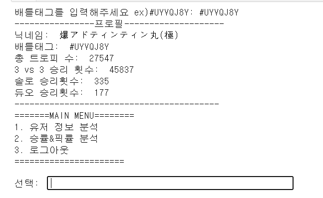  <br>
    - 배틀태그를 입력하면 프로필을 보여준다. <br>
    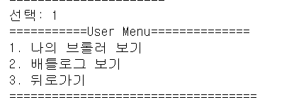   <br>
    - 메뉴에서 1번을 선택하면 유저메뉴를 보여준다.<br>
    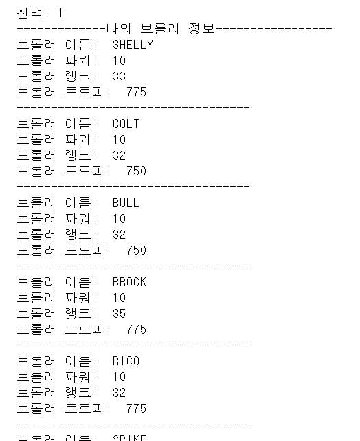<br>
    - 유저 메뉴에서 1번을 선택했을 경우 내가 가진 브롤러 정보를 보여준다<br>
    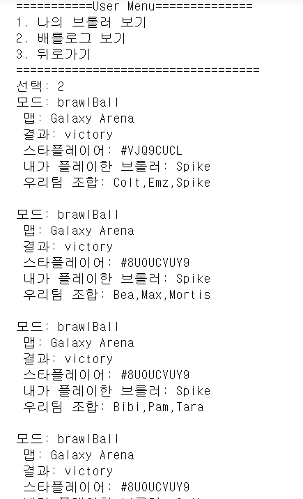<br>
    - 유저 메뉴에서 2번을 선택하면 유저의 배틀로그를 보여준다<br>
 

2. 맵 별 승률이 높은 브롤러 & 조합 순위   
    
    구현 계획: 이 부분은 위에 나열한 사이트들과 내용이 겹치기 때문에 오픈 소스가 있다면 활용할 계획이다.<br>   
    => 찾아본 결과 https://brawlstats.com 가 오픈소스 사이트이므로 이 사이트를 크롤링을 하려고 했으나<br> 
   selenium을 이용해 동적으로 데이터를 수집했음에도 일부 데이터에 대한 접근이 막혀있어 실패했다. <br>
    => 크롤링할 사이트를 정적 데이터 수집이 가능한 https://www.starlist.pro/ 로 변경해서 승률 정보를 가져온다.<br>
    
      <br>
    - 배틀태그를 입력하면 프로필을 보여준다. <br>
    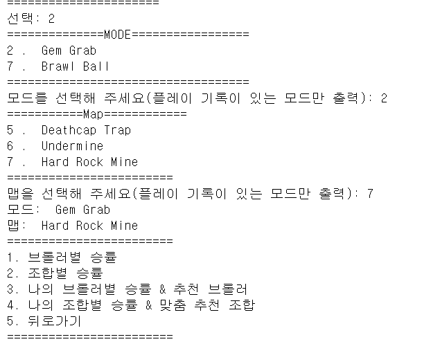   <br>
    - 메뉴에서 2번을 선택하면 승률 분석을 시작한다.<br>
    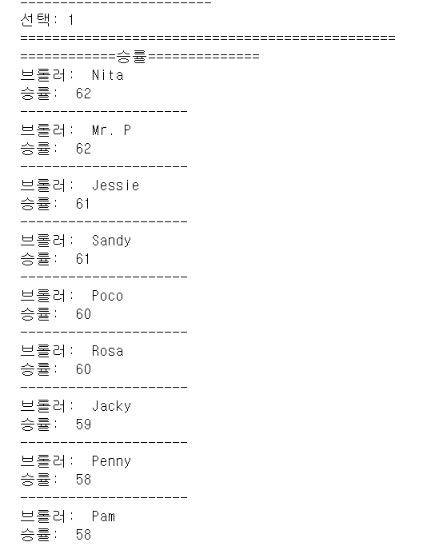<br>
    - 승률 메뉴에서 1번을 선택했을 경우 일반적인 브롤러 승률을 보여준다<br>
    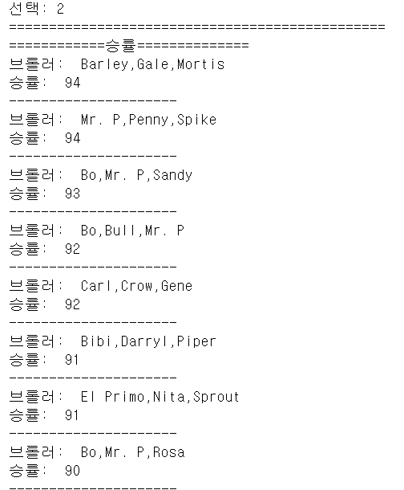<br>
    - 승률 메뉴에서 2번을 선택하면 일반적인 조합의 승률을 보여준다<br>
    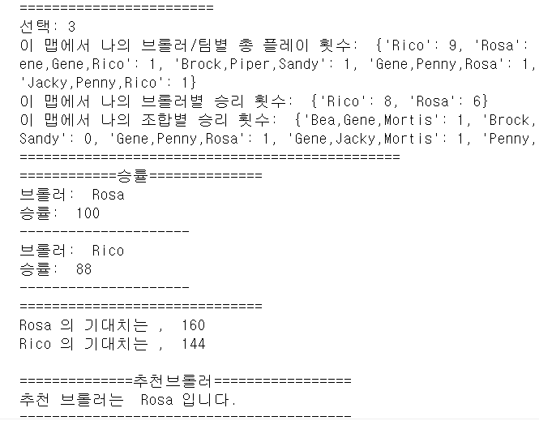<br>
    - 승률 메뉴에서 3번을 선택하면 나의 브롤러별 승률과 추천 브롤러를 보여준다   <br>
    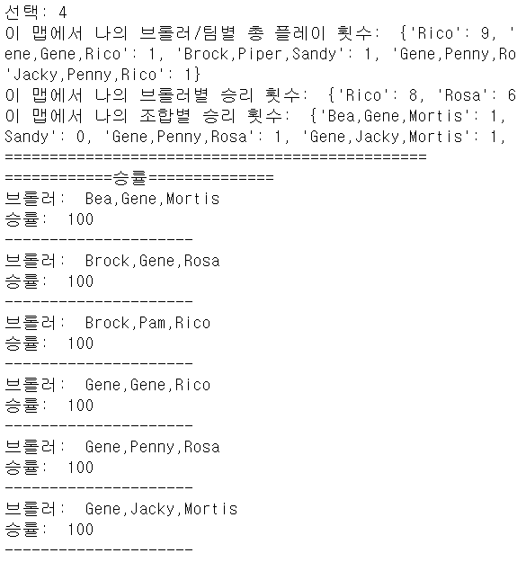<br>
    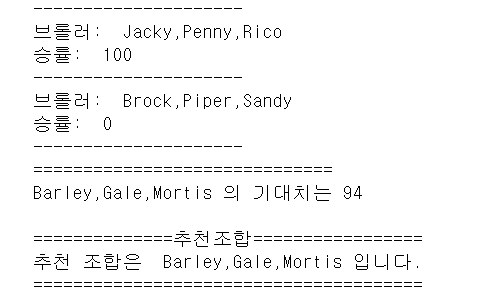<br>
    - 승률 메뉴에서 4번을 선택하면 나의 조합별 승률과 추천 조합을 보여준다   <br>
               
              
## 6) 결론

   - 34개의 브롤러끼리 조합하는 것은 아주 많은 경우의 수가 있기 때문에 내가 플레이한 브롤러의 조합과 일치하는 조합을 찾기 힘들다.<br>
     심지어 공식 api에서 최근 전투기록을 25개 까지 밖에 제공하지 않기 때문에 정보가 더 부족하다.<br>
     그러므로 헤당 프로그램에서는 일반적으로 가장 승률이 높은 팀 조합을 추천하게 되는 경우가 압도적이다.<br>
     따라서 조합별 브롤러 추천은 현실적으로 어렵다.<br>
    <br>
     <br>
   - 브롤러 추천의 경우에는 일반적으로 승률이 높은 브롤러와 내가 플레이한 브롤러 중 승률이 높은 브롤러들의 승률을 <br>
     단순하게 더해서 기대치를 만듦으로써 가장 높은 기대치를 가진 브롤러를 추천하도록 했다.<br>
     이렇게 함으로써 대략적인 브롤러 추천이 가능하게 된다.<br>
   
     따라서 본래 프로젝트 목표의 70%정도를 이루었다고 생각한다.<br>
